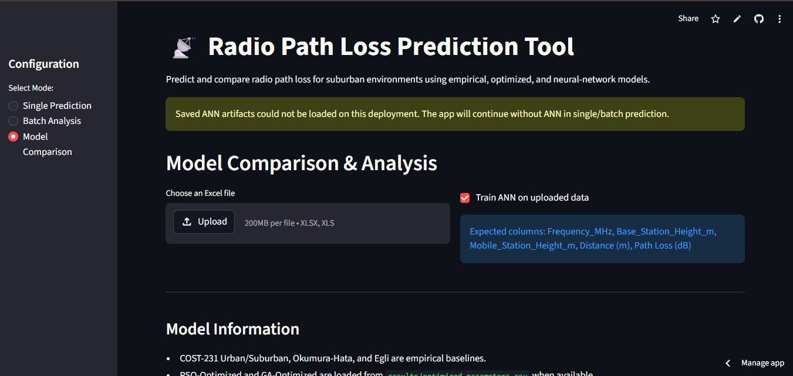

# Design and Implementation of a Meta-heuristic based Path Loss Model for Suburban Environments

Radio propagation prediction for suburban environments using empirical models, metaheuristic optimization, an Artificial Neural Network (ANN), and a Streamlit UI which can be viewed here: https://gjlox6cectvaxdkklzfz4s.streamlit.app/.

## Current Status

This project runs successfully in the `pathloss` Conda environment using Python 3.11 and TensorFlow 2.15.1. The analysis runner was executed on May 26, 2026 using all three available field datasets:

- `Yaba_updated_with_heights_and_freq.xlsx`
- `Sango Ota.xlsx`
- `Ijebu_ode_updated_with_heights_and_freq.xlsx`

The combined run used 3,616 measurement samples.

## Environment Setup

Use a dedicated Conda environment instead of Anaconda `base`. This avoids mixing packages from `C:\Users\HP\AppData\Roaming\Python\Python312\site-packages`.

```powershell
conda create -n pathloss python=3.11 -y
conda activate pathloss
python -m pip install --upgrade pip setuptools wheel
pip install -r requirements.txt
python -m ipykernel install --user --name pathloss --display-name "Path Loss Python 3.11"
```

In VS Code, select the notebook kernel named `Path Loss Python 3.11`.

## Run The Analysis

Full configured run:

```powershell
conda activate pathloss
python run_analysis.py
```

Quick smoke run:

```powershell
conda activate pathloss
python run_analysis.py --fast
```

The runner writes outputs to `results/`:

- `model_comparison_results.csv`
- `path_loss_predictions.csv`
- `optimized_parameters.csv`
- `optimization_history.csv`
- `ann_model.keras`
- `ann_scaler.pkl`
- `ann_metadata.csv`

`ann_model.keras` and `ann_scaler.pkl` are loaded by the Streamlit app so the ANN can be used for single-point and batch predictions without retraining every time.

## Streamlit App

Start the web UI with:

```powershell
conda activate pathloss
streamlit run app.py
```

Then open:

```text
http://localhost:8501
```

The app supports:

- Single point path-loss prediction with empirical, optimized, and saved ANN models
- Batch prediction across a distance range with empirical, optimized, and saved ANN models
- Uploaded Excel measurement comparison
- CSV export of prediction results

The app loads these model groups:

- Empirical baselines: COST-231 Urban, COST-231 Suburban, Okumura-Hata Suburban, Egli
- Optimized models: PSO-Optimized and GA-Optimized from `results/optimized_parameters.csv`
- ANN: saved Keras model from `results/ann_model.keras` with scaler from `results/ann_scaler.pkl`

In Model Comparison mode, the app can also train a fresh ANN on the uploaded file when `Train ANN on uploaded data` is checked.

Expected upload columns:

```text
Frequency_MHz
Base_Station_Height_m
Mobile_Station_Height_m
Distance (m)
Path Loss (dB)
```

## Application Interface

The Streamlit app features three main modes of operation:

### 1. Single Point Prediction


Allows real-time prediction of path loss at a specific location. Users configure:
- **Input Parameters**: Frequency (MHz), Base Station Height (m), Mobile Station Height (m), Distance (km)
- **Selected Models**: Multi-select from available models (COST-231 Urban/Suburban, Okumura-Hata, Egli, PSO-Optimized, GA-Optimized, and/or ANN if available)
- **Results Display**: A table showing path loss predictions (dB) for each selected model, plus summary statistics (Average, Min, Max, Std Dev)

### 2. Batch Analysis


Generates predictions across a distance range with a fixed configuration. Users specify:
- **Configuration**: Frequency, Base Station Height, Mobile Height (common for all predictions)
- **Distance Range**: Minimum distance (km), maximum distance (km), and number of points to generate
- **Model Selection**: Choose which models to include in the analysis
- **Outputs**: 
  - Interactive plot of Path Loss vs Distance for all selected models
  - Detailed results table with distances and predictions for each model
  - CSV export button to download results for further analysis

### 3. Model Comparison & Analysis



Enables comparative evaluation of models against uploaded field measurement data. Users can:
- **Upload Data**: Select an Excel file (XLSX or XLS) containing field measurements
- **Train ANN**: Optionally train a fresh ANN on the uploaded dataset
- **Compare Models**: Automatically compute predictions from all available models
- **View Metrics**: Performance metrics table (RMSE, MAE, R²) sorted by error
- **Visualizations**:
  - Path Loss Comparison plot (predicted vs measured)
  - Error Distribution box plot showing model prediction errors
  - Residuals analysis with per-model error statistics
  - Download capabilities for detailed results

## Latest Full-Run Results

Results from the combined three-dataset run:

| Model | RMSE | MAE | R2 |
|---|---:|---:|---:|
| ANN | 7.3958 | 5.4898 | 0.3434 |
| PSO-Optimized | 8.1681 | 6.0866 | 0.1991 |
| GA-Optimized | 8.5027 | 6.4160 | 0.1322 |
| Egli Model | 19.1030 | 15.0013 | -3.3804 |
| COST-231 Urban | 26.7700 | 24.1296 | -7.6022 |
| COST-231 Suburban | 31.3225 | 28.9849 | -10.7768 |
| Okumura-Hata Suburban | 39.6785 | 37.8328 | -17.8984 |

Saved ANN metadata:

| Metric | Value |
|---|---:|
| Train samples | 2,892 |
| Held-out test samples | 724 |
| Full-data RMSE | 7.3958 |
| Held-out RMSE | 7.5703 |
| Held-out MAE | 5.6847 |
| Held-out R2 | 0.3613 |

## Observations

- The saved ANN is currently the top-performing model on the combined dataset, with RMSE of 7.3958 dB.
- The optimized COST-231 variants are still far better than the unoptimized empirical models on the combined dataset.
- PSO and GA remain useful interpretable optimized-formula baselines, while ANN provides the strongest data-driven benchmark.
- The baseline empirical models show negative R2 on the combined data, meaning they perform worse than predicting the global mean path loss for this combined field dataset.
- PSO convergence flattened after roughly 650-800 iterations, so 1000 iterations is reasonable for final reporting but more than needed for quick checks.
- The previous `requirements.txt` pinned TensorFlow 2.13, which is not suitable for the Python 3.12 setup that caused the DLL/runtime issue. The project is now documented around Python 3.11 and TensorFlow 2.15.1.

## Recommendations

- Use `Path Loss Python 3.11` for the notebook and the `pathloss` Conda environment for terminal runs.
- Keep `base` Anaconda clean; install project packages into `pathloss`.
- Treat `run_analysis.py --fast` as a smoke test before running the full optimization.
- Report full-run results from `results/model_comparison_results.csv`, not from a quick smoke run.
- Use the saved ANN in Streamlit for quick single-point and batch prediction, but report its held-out metrics from `results/ann_metadata.csv`.
- Consider site-held-out validation before making final research claims. The current ANN uses a random train/test split across the combined dataset.
- Investigate site-specific performance for Yaba, Sango Ota, and Ijebu Ode separately; the combined R2 suggests each location may need separate calibration or extra features.
- Add terrain/elevation-derived features if the ANN or optimized formula is expected to generalize beyond these three routes.
- Retrain and resave the ANN artifacts after adding new measurement data so the UI predictions stay aligned with the latest dataset.

## Project Files

- `Path_Loss_Enhanced.ipynb` - notebook workflow
- `run_analysis.py` - command-line workflow
- `app.py` - Streamlit interface
- `models.py` - empirical and wrapper model implementations
- `optimization.py` - PSO and GA optimizers
- `analysis.py` - metrics and diagnostics
- `config.yaml` - datasets and run configuration
- `requirements.txt` - working environment dependencies
- `results/ann_model.keras` - saved ANN model used by Streamlit
- `results/ann_scaler.pkl` - saved feature scaler used by Streamlit
